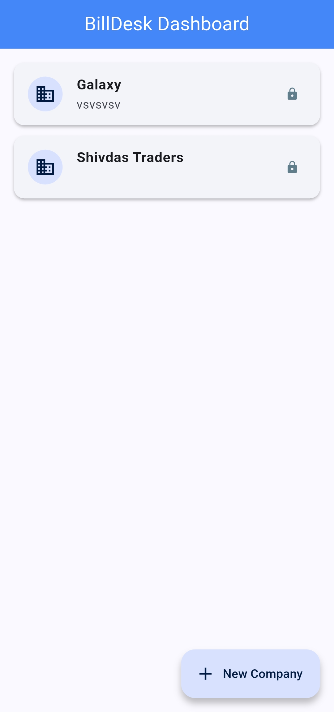
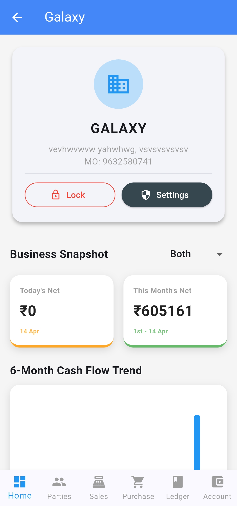
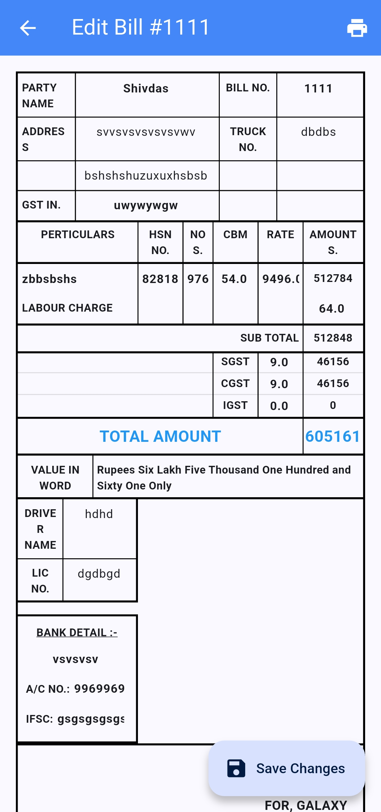
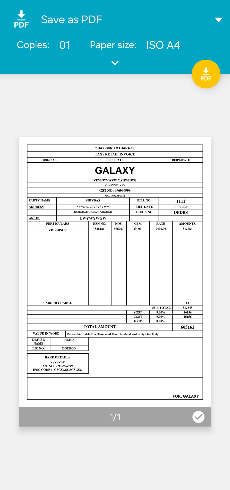

# 💼 BillDesk 

  
  
  
  

 

> **A robust, offline-first multi-company accounting application built with Flutter and SQLite.**

BillDesk is a complete desktop and mobile workspace designed for industrial and retail environments. It features dynamic billing engines, automated GST calculations, and pixel-perfect PDF invoice generation tailored to match traditional industrial bill books.

---

## ✨ Key Features

* 🏢 **Multi-Company Architecture:** Manage multiple businesses from a single app, with individual datasets and configurations.
* 🔒 **PIN-Secured Workspace:** Built-in security wrapper requiring a custom PIN to enter each company's financial dashboard.
* 🧾 **Pixel-Perfect PDF Generation:** Generates strict, grid-aligned industrial-standard invoices and purchase vouchers with custom typography (Copperplate Gothic, Aharoni, Bookman Old Style).
* 🧮 **Automated Taxation Engine:** Real-time calculation of Labour Charges, Sub-Totals, SGST, CGST, IGST, and Grand Totals.
* 📊 **Real-Time Visual Analytics:** Features a 6-month cash flow bar chart and top outstanding receivables pie chart using `fl_chart`.
* 🔤 **Dynamic Number-to-Words:** Automatically translates total Indian Rupee amounts into localized text strings.
* 💻 **Cross-Platform:** Runs natively on Android, iOS, and Windows Desktop (`sqflite_common_ffi`).
---

## 📸 Screenshots

*(Replace these placeholder links with actual screenshots of your app later!)*

| Global Dashboard | Visual Analytics | Editable Invoice | Bill Generation |
| :---: | :---: | :---: | :---: |
|  |  |  |  |

---

## 🛠️ Tech Stack

* **Framework:** [Flutter](https://flutter.dev/)
* **State Management:** [Riverpod](https://riverpod.dev/) (`flutter_riverpod`)
* **Local Database:** [SQLite](https://pub.dev/packages/sqflite) (`sqflite` & `sqflite_common_ffi` for Desktop)
* **PDF Generation:** [`pdf`](https://pub.dev/packages/pdf) & [`printing`](https://pub.dev/packages/printing)
* **Charting:** [`fl_chart`](https://pub.dev/packages/fl_chart)

---

## 🚀 Getting Started

### Prerequisites

To run this application locally, you need to have the Flutter SDK installed. 

**For Windows Desktop Compilation:**
You MUST have Microsoft's C++ compiler installed. 
1. Download [Visual Studio 2022 Build Tools](https://visualstudio.microsoft.com/downloads/).
2. During installation, ensure you check the **"Desktop development with C++"** workload.

### Project Structure

  lib/
 ┣core/
 ┃ ┣ database/         # SQLite initialization and helpers
 ┃ ┣ utils/            # PDF Generator, Number-to-Words, formatters
 ┃ ┗ theme/            # App colors and styling
 ┣ models/             # Data models (Invoice, Company, Purchaser)
 ┣ features/
 ┃ ┣ dashboard/        # Global multi-company selection screen
 ┃ ┣ company_workspace/# Analytics, PIN security, settings
 ┃ ┗ billing/          # Invoice creation, editing, and PDF preview
 ┗ main.dart           # App entry point & FFI initialization

 
